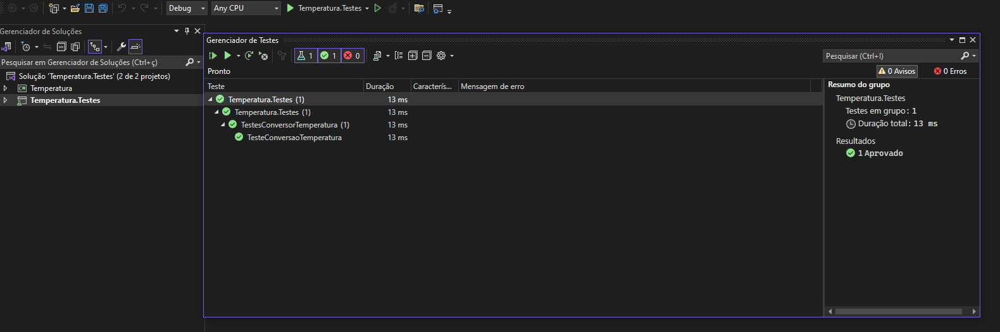

# Aplicando Testes

## Teste Unitário com xUnit

### Descrição
Um teste de unidade é um teste que exercita componentes ou métodos de software individuais, também conhecidos como "unidade de trabalho". Testes de unidade devem testar apenas o código dentro do controle do desenvolvedor. Eles não testam questões de infraestrutura. Questões de infraestrutura incluem bancos de dados, sistemas de arquivos e recursos de rede.

xUnit é um framework de teste unitário para .NET, muito utilizado por ser simples e ter capacidade de suportar testes parametrizados e teóricos de maneira robusta. O xUnit é compatível com várias versões do .NET, incluindo .NET Framework, .NET Core e .NET 5, e integra-se com ferramentas de desenvolvimento, como o Visual Studio.

Para criar testes unitários com xUnit, é necessário primeiro configurar o ambiente de teste no projeto .NET. Isso inclui a instalação do pacote NuGet xUnit, além do xUnit runner que é necessário para a execução dos testes no Visual Studio.

Os testes são estruturados utilizando os atributos **Theory** e **InlineData**, que permitem a execução de testes parametrizados. Isso significa que podemos fornecer vários conjuntos de entradas e saídas esperadas para o mesmo teste, aumentando a cobertura de testes sem a necessidade de escrever métodos de teste separados para cada cenário.

### Testes realizados
Existiam dois cenários de testes, um com sucesso e outro com o intuito de falha, a seguir o código com os dois tipos e depois a imagem com o teste sendo executado.

```csharp
public static class ConversorTemperatura
{
    public static double FahrenheitParaCelsius(double temperatura)
        => (temperatura - 32) / 1.8;
}
```

### Teste executado com sucesso


## Testes de Integração com MSTest

### Descrição
MSTest é o framework de testes unitários que permite aos desenvolvedores verificar o comportamento do código de maneira isolada e automatizada. Ele suporta uma variedade de testes, incluindo testes de unidade básicos, testes parametrizados e testes dirigidos por dados.

Uma das características mais poderosas do MSTest é a sua capacidade de realizar testes parametrizados. Isso é possível através dos atributos **DataTestMethod** e **DataRow**, que permitem executar um único método de teste várias vezes com diferentes conjuntos de dados. Esse recurso é extremamente útil quando você deseja testar a mesma função com vários valores de entrada, garantindo a robustez e a corretude do código em diversos cenários.

### Testes realizados
Existiam dois cenários de testes, um com sucesso e outro com o intuito de falha, a seguir o código com os dois tipos e depois a imagem com o teste sendo executado.

```csharp
[TestClass]
public class TestesConversorTemperatura
{
    [DataRow(32, 0)]
    [DataRow(47, 8.33)]
    [DataRow(86, 30)]
    [DataRow(90.5, 32.5)]
    [DataRow(120.18, 48.99)]
    [DataRow(212, 100)]
    [DataTestMethod]
    public void TesteConversaoTemperatura(double tempFahrenheit, double tempCelsius)
    {
        double valorCalculado = ConversorTemperatura.FahrenheitParaCelsius(tempFahrenheit);
        Assert.AreEqual(tempCelsius, valorCalculado);
    }
}
```

### Teste executado com sucesso


## Testes com Mock Objects

### Descrição
Mock Objects são uma ferramenta fundamental no desenvolvimento de software, e na construção de testes unitários, onde simulam o comportamento de objetos reais em um ambiente controlado. Esses objetos são muito úteis para simular as dependências externas, o que permite o teste dos componentes de maneira isolada. Isso evita a necessidade de interações com bancos de dados, APIs externas ou qualquer outro serviço que possa variar, ser instável ou difícil de replicar em um ambiente de teste.

O principal objetivo dos Mock Objects é permitir que sejam configuradas expectativas, retornos e comportamentos esperados das dependências que não fazem parte do teste em si. Com mocks, é possível assegurar que o código em teste se comporta como esperado, independentemente das variações ou instabilidades de outras dependências externas.

### Testes realizados
Existiam dois cenários de testes, um com sucesso e outro com o intuito de falha, a seguir o código com os dois tipos e depois a imagem com o teste sendo executado.

```csharp
public class TestesConversorTemperatura
{
    [Fact]
    public void TesteConversaoTemperatura()
    {
        // Arrange
        var mockConversor = new Mock<IConversorTemperatura>();
        mockConversor.Setup(m => m.FahrenheitParaCelsius(It.IsAny<double>())).Returns((double t) => (t - 32) / 1.8);

        // Act
        double resultado = mockConversor.Object.FahrenheitParaCelsius(100);

        // Assert
        Assert.Equal(37.78, resultado, 2);
    }
}
```

### Teste executado com sucesso


